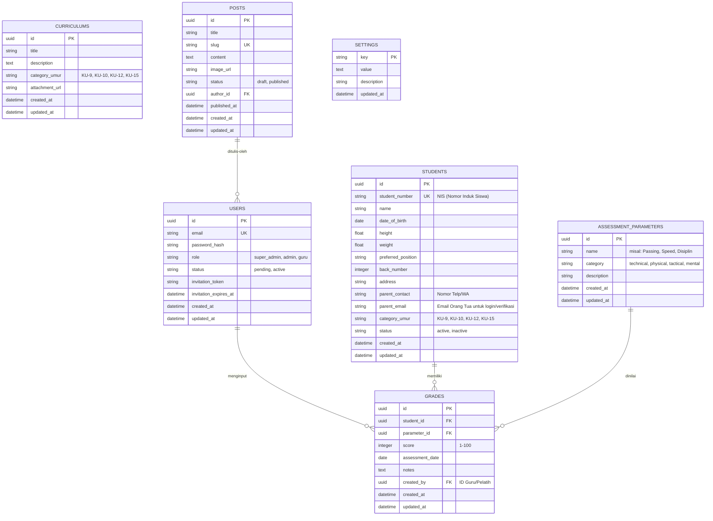

# Database Schema Design - Aplikasi SSB Baturetno

Dokumen ini menjelaskan struktur basis data relasional yang digunakan untuk mendukung aplikasi manajemen SSB Baturetno. Database yang digunakan adalah **PostgreSQL** yang diinang (hosted) pada **Supabase**.

---

## 1. Diagram Relasi Entitas (ERD)

---

## 2. Detail Spesifikasi Tabel

### A. Tabel `users`
Menyimpan informasi pengguna internal sistem (Super Admin, Admin, Guru).
* `id` (UUID, Primary Key)
* `email` (VARCHAR, Unique, Not Null)
* `password_hash` (VARCHAR, Nullable - kosong saat status 'pending')
* `role` (VARCHAR: 'super_admin', 'admin', 'guru', Not Null)
* `status` (VARCHAR: 'pending', 'active', Default: 'pending')
* `invitation_token` (VARCHAR, Nullable, untuk verifikasi email)
* `invitation_expires_at` (DATETIME, Nullable)

### B. Tabel `students`
Menyimpan profil siswa SSB Baturetno.
* `id` (UUID, Primary Key)
* `student_number` (VARCHAR, Unique, Not Null) - NIS (Nomor Induk Siswa/Nomor Pelajar).
* `name` (VARCHAR, Not Null)
* `date_of_birth` (DATE, Not Null)
* `height` (FLOAT, Nullable) - tinggi dalam cm.
* `weight` (FLOAT, Nullable) - berat dalam kg.
* `preferred_position` (VARCHAR, Nullable)
* `back_number` (INTEGER, Nullable)
* `address` (TEXT, Nullable)
* `parent_contact` (VARCHAR, Not Null) - nomor WA/telp orang tua.
* `parent_email` (VARCHAR, Nullable) - email orang tua untuk verifikasi step 1.
* `category_umur` (VARCHAR: 'KU-9', 'KU-10', 'KU-12', 'KU-15', Not Null)
* `status` (VARCHAR: 'active', 'inactive', Default: 'active')

### C. Tabel `assessment_parameters`
Menyimpan parameter penilaian performa siswa yang dapat dikonfigurasi secara dinamis.
* `id` (UUID, Primary Key)
* `name` (VARCHAR, Not Null) - contoh: "Passing", "Dribbling", "Speed", "Agility".
* `category` (VARCHAR: 'technical', 'physical', 'tactical', 'mental', Not Null)
* `description` (TEXT, Nullable)

### D. Tabel `grades`
Menyimpan data nilai berkala yang diinput oleh Guru/Pelatih.
* `id` (UUID, Primary Key)
* `student_id` (UUID, Foreign Key ke `students.id`, Cascade Delete)
* `parameter_id` (UUID, Foreign Key ke `assessment_parameters.id`)
* `score` (INTEGER, range 1-100, Not Null)
* `assessment_date` (DATE, Not Null)
* `notes` (TEXT, Nullable)
* `created_by` (UUID, Foreign Key ke `users.id`)

### E. Tabel `curriculums`
Menyimpan materi latihan dan silabus per kelompok umur.
* `id` (UUID, Primary Key)
* `title` (VARCHAR, Not Null)
* `description` (TEXT, Nullable)
* `category_umur` (VARCHAR: 'KU-9', 'KU-10', 'KU-12', 'KU-15', Not Null)
* `attachment_url` (VARCHAR, Nullable)

### F. Tabel `posts`
Menyimpan artikel berita / pengumuman SSB Baturetno.
* `id` (UUID, Primary Key)
* `title` (VARCHAR, Not Null)
* `slug` (VARCHAR, Unique, Not Null)
* `content` (TEXT, Not Null)
* `image_url` (VARCHAR, Nullable)
* `status` (VARCHAR: 'draft', 'published', Default: 'draft')
* `author_id` (UUID, Foreign Key ke `users.id`)
* `published_at` (DATETIME, Nullable)

### G. Tabel `settings`
Menyimpan konfigurasi halaman dinamis (Homepage, About Us, Contact Us) dalam format key-value.
* `key` (VARCHAR, Primary Key) - Contoh: 'homepage_hero_title', 'about_us_history', 'contact_whatsapp_link'.
* `value` (TEXT, Nullable)
* `description` (VARCHAR, Nullable)
* `updated_at` (DATETIME)
