# Roadmap, Timeframe, dan Estimasi Biaya
## Proyek Pengembangan Aplikasi SSB Baturetno oleh Ashvin Labs

Dokumen ini menyajikan rencana kerja (roadmap), lini masa (timeframe), serta estimasi biaya pengembangan dan operasional untuk aplikasi manajemen Sekolah Sepak Bola (SSB) Baturetno.

---

## 1. Roadmap & Timeframe (Lini Masa Kerja)

Pengembangan aplikasi ini direncanakan berlangsung selama **10 Minggu** (sekitar 2,5 bulan), terbagi ke dalam 6 Milestone utama:

```mermaid
graph LR
    M1["W1: Analisis & Wireframe"] --> M2["W2-3: Setup DB & Auth"]
    M2 --> M3["W4-5: Siswa & Kurikulum"]
    M3 --> M4["W6-7: Nilai & Portal Ortu"]
    M4 --> M5["W8-9: Web Publik & CMS"]
    M5 --> M6["W10: QA & Release"]
    
    style M1 fill:#e1f5fe,stroke:#03a9f4,stroke-width:2px;
    style M2 fill:#e8f5e9,stroke:#4caf50,stroke-width:2px;
    style M3 fill:#e8f5e9,stroke:#4caf50,stroke-width:2px;
    style M4 fill:#e8f5e9,stroke:#4caf50,stroke-width:2px;
    style M5 fill:#fff3e0,stroke:#ff9800,stroke-width:2px;
    style M6 fill:#ffebee,stroke:#f44336,stroke-width:2px;
```

### Tabel Rangkuman Lini Masa (Timeframe Summary)

| Milestone | Durasi (Waktu) | Deskripsi Tahapan Pengembangan |
| :--- | :--- | :--- |
| **Milestone 1** | Minggu 1 | Analisis kebutuhan sistem & persetujuan desain wireframe awal. |
| **Milestone 2** | Minggu 2 - 3 | Inisialisasi Next.js, database Supabase, dan alur aktivasi email staf. |
| **Milestone 3** | Minggu 4 - 5 | Pengembangan modul pengelolaan data murid (KU 9, 10, 12, 15) & kurikulum. |
| **Milestone 4** | Minggu 6 - 7 | Modul penilaian guru & gerbang masuk verifikasi rapor orang tua. |
| **Milestone 5** | Minggu 8 - 9 | Halaman depan publik (Homepage, Blog/Berita) & CMS pengelola konten. |
| **Milestone 6** | Minggu 10 | Pengujian menyeluruh (QA), peluncuran produksi (Vercel), & pelatihan staf. |

### Rincian Milestone:

*   **Milestone 1: Analisis Kebutuhan & Finalisasi Wireframe (Minggu 1)**
    *   Penyelarasan dokumentasi TRD, skema database, dan wireframe halaman.
    *   Persetujuan desain antarmuka dasar.
*   **Milestone 2: Inisialisasi Proyek, Database, & User Management (Minggu 2 - 3)**
    *   Setup Next.js, Prisma, dan Supabase PostgreSQL.
    *   Pembuatan fitur undangan staf lewat email (Resend API) dan aktivasi password.
*   **Milestone 3: Pengelolaan Data Murid & Kurikulum (Minggu 4 - 5)**
    *   Pembuatan modul CRUD murid (KU-9, 10, 12, 15) dan generator nomor NIS otomatis.
    *   Pembuatan modul kurikulum per kelompok umur.
*   **Milestone 4: Input Nilai & Verifikasi Rapor Orang Tua (Minggu 6 - 7)**
    *   Antarmuka input nilai dinamis untuk guru/pelatih.
    *   Pengembangan alur verifikasi rapor orang tua 2-langkah (Nama/Email/NIS + Tanggal Lahir).
*   **Milestone 5: Web Publik (Homepage, Blog) & Ekspor PDF/Excel (Minggu 8 - 9)**
    *   Halaman depan publik (Homepage, About, Contact) dan sistem manajemen berita (CMS).
    *   Implementasi unduhan rapor PDF terproteksi sandi dan ekspor data ke file Excel.
*   **Milestone 6: Pengujian (QA), Deployment, & Serah Terima (Minggu 10)**
    *   Pengujian menyeluruh (keamanan token, ekspor laporan, integrasi email).
    *   Deployment final ke Vercel dan penyambungan domain kustom.
    *   Pelatihan (training) penggunaan sistem untuk staf SSB Baturetno.

## 2. Rincian Anggaran Biaya Tahun Pertama (First Year Budget)

Anggaran tahun pertama mencakup biaya pengembangan aplikasi oleh **Ashvin Labs** digabungkan dengan biaya sewa infrastruktur cloud dasar dan domain untuk 12 bulan pertama:

| Komponen Anggaran | Penjelasan Item | Estimasi Biaya (IDR) |
| :--- | :--- | :--- |
| **Jasa Pengembangan Aplikasi** | Pengembangan UI/UX, Next.js, Database Postgres, integrasi Resend Email, Rapor PDF & Ekspor Excel | Rp 9.500.000 |
| **Biaya Operasional & Infrastruktur (Tahun 1)** | Pembelian Domain resmi (.com/.id), kuota email sistem, sewa database cloud & web hosting | Rp 2.000.000 |
| **Total Anggaran Tahun Pertama** | **Pengembangan Sistem + Operasional & Domain Tahun Pertama** | **Rp 11.500.000** |

---

## 3. Rincian Anggaran Biaya Tahun Kedua & Seterusnya (Maintenance & Operational Only)

Mulai tahun kedua, biaya pengembangan ditiadakan (minus pengembangan). Anggaran hanya digunakan untuk perpanjangan domain dan kebutuhan sewa server/database agar sistem terus berjalan:

| Komponen Anggaran | Penjelasan Item | Estimasi Biaya Per Tahun (IDR) |
| :--- | :--- | :--- |
| **Biaya Operasional & Infrastruktur (Tahunan)** | Perpanjangan hak nama domain resmi, sewa database cloud, hosting Next.js, dan kuota email sistem | Rp 2.000.000 |
| **Total Anggaran Tahunan (Mulai Tahun ke-2)** | **Biaya Perpanjangan Operasional & Domain** | **Rp 2.000.000 / tahun** |

## 4. Ketentuan Pembayaran (Term of Payment)

Untuk menjamin kelancaran pengerjaan proyek, sistem pembayaran dibagi menjadi **2 Termin (50% / 50%)**:
1.  **Termin 1 (DP 50%):** Pembayaran uang muka (down payment) sebesar 50% setelah persetujuan rencana kerja & penandatanganan kesepakatan pengerjaan (Milestone 1).
2.  **Termin 2 (Pelunasan 50%):** Pembayaran akhir sebesar 50% setelah sistem selesai diuji, didemonstrasikan, dideploy ke server produksi (Vercel & Supabase), serta serah terima sistem secara penuh (Milestone 6).
