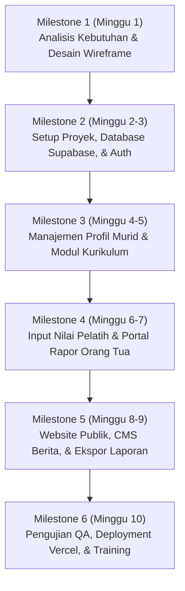

# Roadmap, Timeframe, dan Estimasi Biaya
## Proyek Pengembangan Aplikasi SSB Baturetno oleh Ashvin Labs

Dokumen ini menyajikan rencana kerja (roadmap), lini masa (timeframe), serta estimasi biaya pengembangan dan operasional untuk aplikasi manajemen Sekolah Sepak Bola (SSB) Baturetno.

---

## 1. Roadmap & Timeframe (Lini Masa Kerja)

Pengembangan aplikasi ini direncanakan berlangsung selama **10 Minggu** (sekitar 2,5 bulan), terbagi ke dalam 6 Milestone utama:

### Rincian Milestone:

*   **Milestone 1: Analisis Kebutuhan & Finalisasi Wireframe (Minggu 1)**
    *   Penyelarasan dokumentasi TRD, skema database, dan wireframe halaman.
    *   Persetujuan desain antarmuka dasar.
*   **Milestone 2: Inisialisasi Proyek, Database, & User Management (Minggu 2 - 3)**
    *   Setup Next.js, Prisma, dan Supabase PostgreSQL.
    *   Pembuatan fitur undangan staf lewat email (Resend API) dan aktivasi password.
*   **Milestone 3: Pengelolaan Data Murid & Kurikulum (Minggu 4 - 5)**
    *   Pembuatan modul CRUD murid (KU-9, 10, 12, 15) dan generator nomor NIS otomatis.
    *   Pembuatan modul kurikulum per kelompok umur.
*   **Milestone 4: Input Nilai & Verifikasi Rapor Orang Tua (Minggu 6 - 7)**
    *   Antarmuka input nilai dinamis untuk guru/pelatih.
    *   Pengembangan alur verifikasi rapor orang tua 2-langkah (Nama/Email/NIS + Tanggal Lahir).
*   **Milestone 5: Web Publik (Homepage, Blog) & Ekspor PDF/Excel (Minggu 8 - 9)**
    *   Halaman depan publik (Homepage, About, Contact) dan sistem manajemen berita (CMS).
    *   Implementasi unduhan rapor PDF terproteksi sandi dan ekspor data ke file Excel.
*   **Milestone 6: Pengujian (QA), Deployment, & Serah Terima (Minggu 10)**
    *   Pengujian menyeluruh (keamanan token, ekspor laporan, integrasi email).
    *   Deployment final ke Vercel dan penyambungan domain kustom.
    *   Pelatihan (training) penggunaan sistem untuk staf SSB Baturetno.

---

## 2. Estimasi Biaya Pengembangan (One-Time Cost)

Estimasi jasa profesional pengembangan sistem oleh **Ashvin Labs** untuk cakupan kerja di atas:

| Keterangan Pekerjaan | Estimasi Biaya (IDR) |
| :--- | :--- |
| **UI/UX Design & Frontend Development** (Tailwind CSS, shadcn/ui, Responsive Layout) | Rp 10.000.000 |
| **Backend & Database Integration** (Next.js Server Actions, Supabase Postgres, Prisma ORM, Security JWT) | Rp 12.000.000 |
| **System Integrations** (Resend Email API, Generator PDF Locked, Export Excel Engine) | Rp 7.000.000 |
| **Testing, Quality Assurance (QA), & Deployment** (Setup Vercel, Hosting, DNS) | Rp 3.000.000 |
| **Training & Dokumentasi Penggunaan** (Pelatihan Staf Admin & Pelatih) | Rp 3.000.000 |
| **Total Estimasi Biaya Pengembangan** | **Rp 35.000.000** |

---

## 3. Estimasi Biaya Operasional (Recurring Cost)

Berikut estimasi biaya pihak ketiga (infrastruktur cloud) yang diperlukan untuk menjaga aplikasi tetap aktif.

### A. Biaya Bulanan (Infrastruktur Cloud)
*   **Database Supabase:**
    *   *Free Tier* (Cukup untuk kapasitas awal SSB) atau *Pro Tier* (Untuk backup terjadwal dan performa tinggi): **$0 - $25/bulan** (Sekitar Rp 0 - Rp 400.000/bulan).
*   **Hosting Vercel:**
    *   *Hobby Tier* (Gratis untuk penggunaan wajar) atau *Pro Tier* (Untuk performa produksi komersial): **$0 - $20/bulan** (Sekitar Rp 0 - Rp 320.000/bulan).
*   **Resend Email Service:**
    *   *Free Tier* (Hingga 3.000 email per bulan - sangat cukup untuk staf SSB Baturetno): **Rp 0/bulan**.

### B. Biaya Tahunan (Domain Name)
*   **Domain Kustom (.com / .id / .my.id):**
    *   Pembelian & perpanjangan domain: **Rp 150.000 - Rp 250.000/tahun** (tergantung ekstensi).

---

## 4. Ketentuan Pembayaran (Term of Payment) - Rekomendasi
Untuk menjamin kelancaran pengerjaan proyek:
1.  **Term 1 (DP 30%):** Pembayaran awal setelah persetujuan rencana kerja (Milestone 1).
2.  **Term 2 (Progress 40%):** Pembayaran setelah Milestone 3 selesai (Manajemen Murid, Staf, & Kurikulum aktif).
3.  **Term 3 (Pelunasan 30%):** Pembayaran akhir setelah sistem selesai diuji, dideploy ke server produksi, dan diserahterimakan (Milestone 6).
