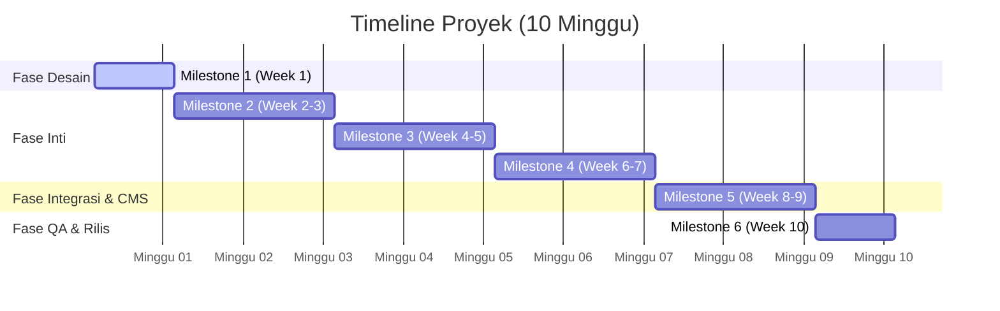

# Roadmap, Timeframe, dan Estimasi Biaya
## Proyek Pengembangan Aplikasi SSB Baturetno oleh Ashvin Labs

Dokumen ini menyajikan rencana kerja (roadmap), lini masa (timeframe), serta estimasi biaya pengembangan dan operasional untuk aplikasi manajemen Sekolah Sepak Bola (SSB) Baturetno.

---

## 1. Roadmap & Timeframe (Lini Masa Kerja)

Pengembangan aplikasi ini direncanakan berlangsung selama **10 Minggu** (sekitar 2,5 bulan), terbagi ke dalam 6 Milestone utama:

*(Catatan: Tanggal di bawah adalah tanggal fiktif untuk mensimulasikan visualisasi timeline mingguan di mana 7 hari = 1 minggu)*

### Rincian Milestone:

*   **Milestone 1: Analisis Kebutuhan & Finalisasi Wireframe (Minggu 1)**
    *   Penyelarasan dokumentasi TRD, skema database, dan wireframe halaman.
    *   Persetujuan desain antarmuka dasar.
*   **Milestone 2: Inisialisasi Proyek, Database, & User Management (Minggu 2 - 3)**
    *   Setup Next.js, Prisma, dan Supabase PostgreSQL.
    *   Pembuatan fitur undangan staf lewat email (Resend API) dan aktivasi password.
*   **Milestone 3: Pengelolaan Data Murid & Kurikulum (Minggu 4 - 5)**
    *   Pembuatan modul CRUD murid (KU-9, 10, 12, 15) dan generator nomor NIS otomatis.
    *   Pembuatan modul kurikulum per kelompok umur.
*   **Milestone 4: Input Nilai & Verifikasi Rapor Orang Tua (Minggu 6 - 7)**
    *   Antarmuka input nilai dinamis untuk guru/pelatih.
    *   Pengembangan alur verifikasi rapor orang tua 2-langkah (Nama/Email/NIS + Tanggal Lahir).
*   **Milestone 5: Web Publik (Homepage, Blog) & Ekspor PDF/Excel (Minggu 8 - 9)**
    *   Halaman depan publik (Homepage, About, Contact) dan sistem manajemen berita (CMS).
    *   Implementasi unduhan rapor PDF terproteksi sandi dan ekspor data ke file Excel.
*   **Milestone 6: Pengujian (QA), Deployment, & Serah Terima (Minggu 10)**
    *   Pengujian menyeluruh (keamanan token, ekspor laporan, integrasi email).
    *   Deployment final ke Vercel dan penyambungan domain kustom.
    *   Pelatihan (training) penggunaan sistem untuk staf SSB Baturetno.

## 2. Rincian Anggaran Biaya Tahun Pertama (First Year Budget)

Anggaran tahun pertama mencakup seluruh jasa pengembangan aplikasi oleh **Ashvin Labs** (one-time fee) digabungkan dengan biaya infrastruktur server produksi serta domain untuk 12 bulan pertama:

| Komponen Anggaran | Detail Spesifikasi | Estimasi Biaya (IDR) |
| :--- | :--- | :--- |
| **Jasa Pengembangan Aplikasi** | UI/UX, Next.js Frontend & Backend API, Database Integration, CMS, Excel/PDF Engine | Rp 9.500.000 |
| **Database Supabase Pro** | PostgreSQL Pro Tier (Backup otomatis, performa tinggi) selama 1 tahun | Rp 4.800.000 |
| **Hosting Vercel Pro** | Server hosting Next.js produksi performa tinggi selama 1 tahun | Rp 3.840.000 |
| **Domain Kustom** | Pendaftaran domain resmi SSB Baturetno (.com / .id / .my.id) untuk 1 tahun | Rp 250.000 |
| **Layanan Email Resend** | Pengiriman email undangan token aktivasi (Free Tier) | Rp 0 |
| **Total Anggaran Tahun Pertama** | **Pengembangan Sistem + Infrastruktur Pro & Domain 1 Tahun** | **Rp 18.390.000** |

---

## 3. Rincian Anggaran Biaya Tahun Kedua & Seterusnya (Maintenance & Operational Only)

Mulai tahun kedua dan seterusnya, biaya pengembangan dari Ashvin Labs ditiadakan (minus pengembangan). Anggaran hanya dialokasikan untuk biaya perpanjangan sewa infrastruktur cloud dan nama domain agar aplikasi tetap aktif:

| Komponen Anggaran | Spesifikasi Operasional | Estimasi Biaya Per Tahun (IDR) |
| :--- | :--- | :--- |
| **Database Supabase Pro** | PostgreSQL Pro Tier (Keamanan data, perpanjangan sewa) | Rp 4.800.000 |
| **Hosting Vercel Pro** | Server hosting Next.js produksi (Perpanjangan sewa) | Rp 3.840.000 |
| **Domain Kustom** | Perpanjangan hak guna nama domain resmi | Rp 250.000 |
| **Resend Email Service** | Layanan pengiriman email transaksi (Free Tier) | Rp 0 |
| **Total Anggaran Tahunan (Mulai Tahun ke-2)** | **Biaya Sewa Server Produksi & Perpanjangan Domain** | **Rp 8.890.000 / tahun** |

## 4. Ketentuan Pembayaran (Term of Payment) - Rekomendasi
Untuk menjamin kelancaran pengerjaan proyek:
1.  **Term 1 (DP 30%):** Pembayaran awal setelah persetujuan rencana kerja (Milestone 1).
2.  **Term 2 (Progress 40%):** Pembayaran setelah Milestone 3 selesai (Manajemen Murid, Staf, & Kurikulum aktif).
3.  **Term 3 (Pelunasan 30%):** Pembayaran akhir setelah sistem selesai diuji, dideploy ke server produksi, dan diserahterimakan (Milestone 6).
