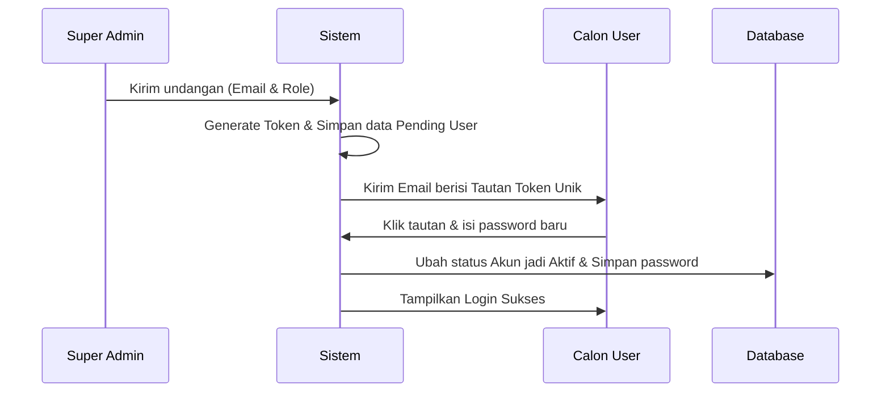
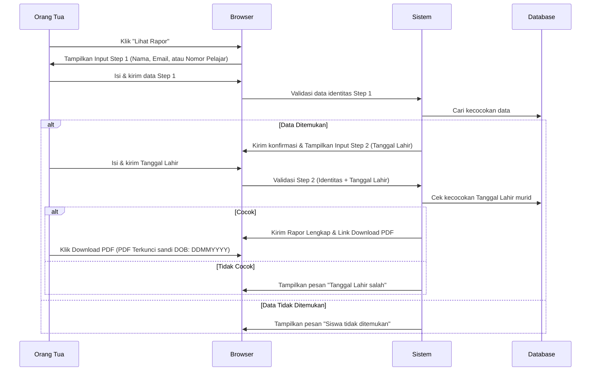

# Technical Requirements Document (TRD) - Aplikasi SSB Baturetno

Dokumen ini mendeskripsikan kebutuhan teknis, arsitektur, fitur, dan alur kerja untuk aplikasi manajemen Sekolah Sepak Bola (SSB) Baturetno.

---

## 1. Pendahuluan
SSB Baturetno memerlukan sistem informasi untuk mengelola data siswa, penilaian perkembangan, dan kurikulum latihan. Sistem ini memiliki 3 level pengguna internal utama dan 1 akses publik aman untuk orang tua siswa.

---

## 2. Pengguna & Hak Akses (User Roles & Permissions)
* **Super Admin:**
  * Memiliki kontrol penuh atas sistem.
  * Mengundang (invite) Admin dan Guru/Pelatih baru melalui email.
  * Mengelola seluruh data siswa, kurikulum, dan konfigurasi sistem.
* **Admin:**
  * Mengelola data siswa (tambah, edit, kelompok umur).
  * Mengelola data kurikulum latihan.
  * Melihat seluruh penilaian.
* **Guru / Pelatih:**
  * Menginput dan memperbarui nilai perkembangan siswa di kelasnya.
  * Melihat kurikulum latihan.
* **Orang Tua Siswa (Akses Publik Tanpa Login):**
  * Mengakses rapor perkembangan anak melalui verifikasi 2-langkah (Input Nama/Email/Nomor Pelajar + Tanggal Lahir).
  * Melihat grafik perkembangan performa anak.
  * Mengunduh rapor dalam format PDF terproteksi sandi (password-protected).

---

## 3. Fitur Utama (Core Features)

### A. Manajemen Pengguna (User Management) & Alur Undangan
* Tidak ada pendaftaran mandiri (public registration) bagi staf/guru.
* **Alur Undangan Akun:**
  1. Super Admin memasukkan email dan peran (Admin/Guru) di dasbor.
  2. Sistem mengirim email undangan berisi tautan token unik yang kedaluwarsa dalam waktu tertentu (misal 48 jam).
  3. Calon pengguna mengklik tautan di email, diarahkan ke halaman pembuatan password di aplikasi.
  4. Pengguna memasukkan password baru, menekan submit, dan status akun berubah menjadi aktif.

### B. Pengelolaan Data Siswa
* **Profil Lengkap:** Nomor Pelajar (Nomor Induk Siswa/NIS - unik), Nama, Tanggal Lahir, Tinggi/Berat Badan, Posisi Bermain, Nomor Punggung, Alamat, Kontak Orang Tua (Email & No WA), dan status keaktifan.
* **Kategori Umur (KU):**
  * Sistem dikelompokkan ke dalam kategori umur: **KU-9, KU-10, KU-12, dan KU-15**.
* **Keamanan Rapor & Ekspor PDF:**
  * Pengunduhan file PDF Rapor akan dikunci (password-protected) menggunakan data unik siswa (seperti tanggal lahir siswa dengan format DDMMYYYY).

### C. Pengelolaan Parameter & Nilai Siswa
* **Parameter Dinamis:**
  * Nilai menggunakan parameter umum sebagai bawaan awal (Default: *Technical, Physical, Tactical, Mental*).
  * Menyediakan modul antarmuka khusus (untuk Admin/Super Admin) untuk menambah, menghapus, atau mengubah parameter penilaian sesuai perkembangan kurikulum.
* **Penilaian Berkala & Rapor PDF:**
  * Pelatih menginput nilai berkala.
  * Halaman Rapor interaktif dengan visualisasi grafik perkembangan.
  * Fitur ekspor Rapor ke PDF dengan satu kali klik.

### D. Pengelolaan Kurikulum
* Modul latihan terorganisir per Kategori Umur (KU).
* Dapat diedit dan disesuaikan jadwalnya oleh Admin/Super Admin.

### E. Modul Public Website & CMS (Content Management System)
* **Halaman Publik:**
  * **Homepage:** Halaman depan dengan hero section, informasi umum SSB Baturetno, ringkasan berita, dan galeri kegiatan.
  * **About Us (Tentang Kami):** Visi, misi, sejarah, susunan pengurus, dan profil pelatih.
  * **Contact Us (Hubungi Kami):** Formulir kontak, alamat Google Maps, email, dan link WhatsApp.
  * **Berita / Blog:** Daftar artikel dan detail artikel berita terbaru dari SSB Baturetno.
* **Fitur CMS (Dashboard Internal):**
  * Antarmuka bagi Admin/Super Admin untuk mengedit konten teks/gambar pada Homepage, About Us, dan Contact Us secara dinamis.
  * Modul blog untuk membuat, mengedit, menghapus (CRUD), dan menerbitkan (publish/draft) artikel berita.

### F. Ekspor Laporan (PDF & Excel)
* **Ekspor PDF Rapor:** Pengunduhan rapor nilai siswa secara instan dengan layout rapi dan grafik perkembangan visual (untuk Orang Tua & Pelatih).
* **Ekspor Excel:** Fitur bagi Admin & Super Admin untuk mengunduh rekap data siswa aktif dan rekap seluruh nilai siswa per kelompok umur (KU) untuk kebutuhan administrasi offline.

---

## 4. Alur Kerja Utama (Key Workflows)

### A. Alur Undangan Pengguna Baru (User Invitation Flow)

### B. Alur Akses Rapor Orang Tua (Secure Parent Access Flow - 2 Steps)

