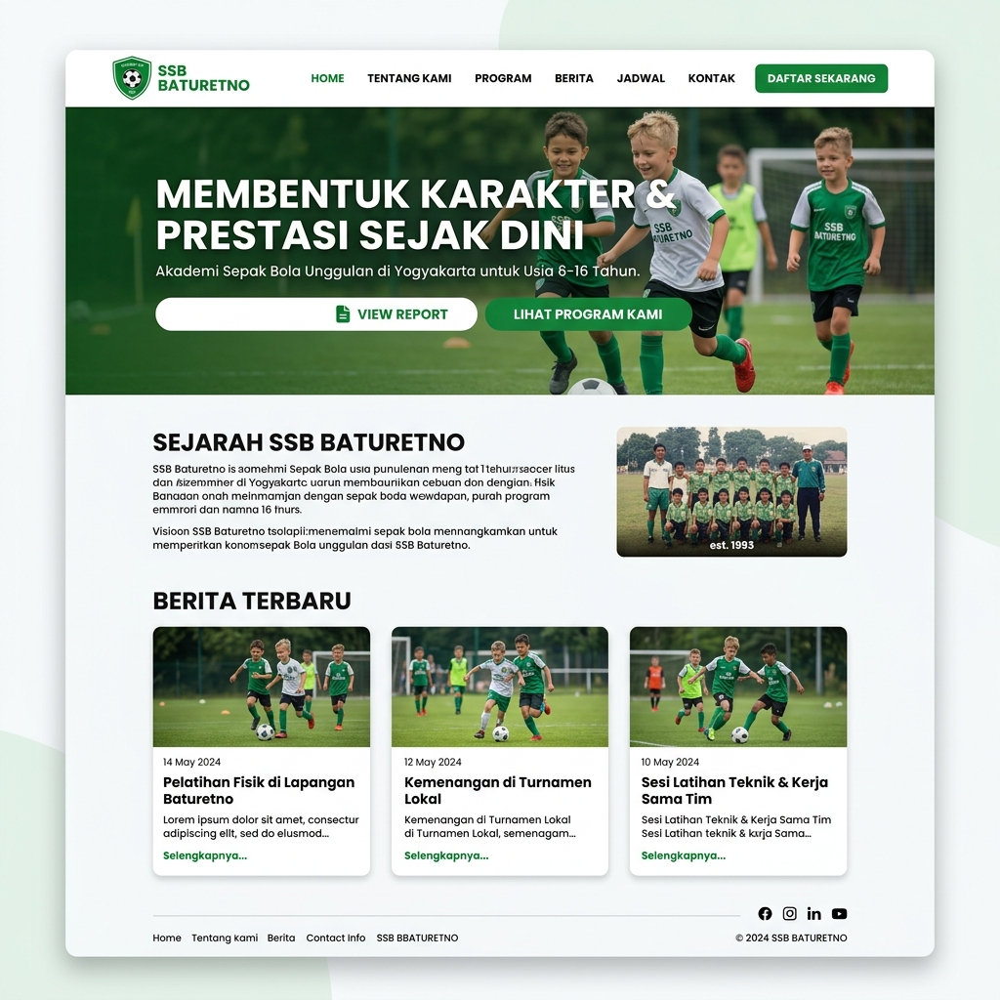
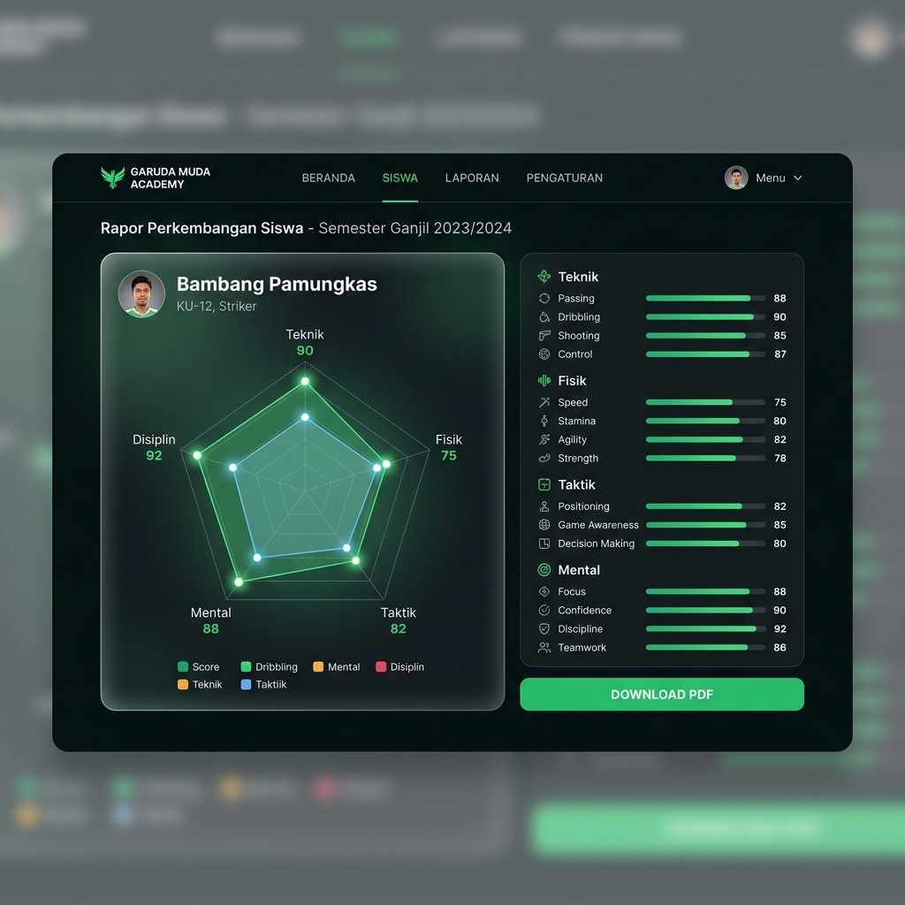
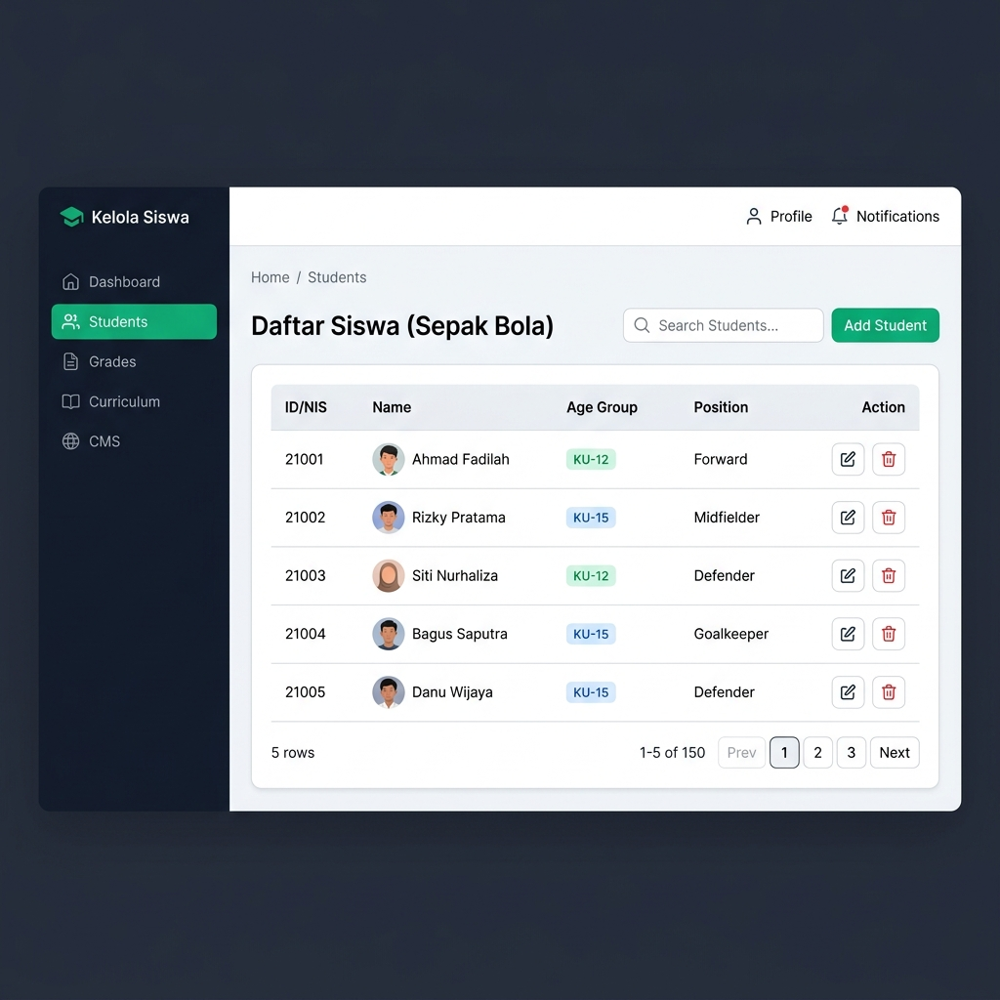

# Wireframe Layouts - Aplikasi SSB Baturetno

Dokumen ini memetakan rancangan tata letak visual (wireframe) halaman-halaman utama aplikasi SSB Baturetno untuk mempermudah pengerjaan antarmuka pengguna (UI).

---

## 1. Portal Publik: Homepage & Verifikasi Rapor

### A. Homepage Utama (`/`)
Halaman depan yang diakses oleh publik dengan nuansa premium, navigasi bersih, dan integrasi artikel berita.



```
+-----------------------------------------------------------------------------+
|  [SSB Baturetno Logo]   Home   Tentang Kami   Berita   Kontak    [Lihat Rapor] |
+-----------------------------------------------------------------------------+
|                                                                             |
|                           HERO SECTION SSB BATURETNO                        |
|                  "Membentuk Karakter & Prestasi Sejak Dini"                 |
|                                                                             |
|           [ Lihat Jadwal Latihan ]         [ Cek Rapor Perkembangan ]       |
|                                                                             |
+-----------------------------------------------------------------------------+
|                                                                             |
|      SEJARAH & TENTANG KAMI                                                 |
|      SSB Baturetno adalah sekolah sepak bola anak yang berfokus pada...     |
|                                                                             |
+-----------------------------------------------------------------------------+
|                                                                             |
|      BERITA & PENGUMUMAN TERBARU                                            |
|      +---------------------+  +---------------------+  +-----------------+  |
|      | [Gambar Artikel 1]  |  | [Gambar Artikel 2]  |  | [Gambar Art. 3] |  |
|      | Latihan Rutin KU-12 |  | Juara Turnamen KU-9 |  | Agenda Latihan  |  |
|      | [Selengkapnya...]   |  | [Selengkapnya...]   |  | [Selengkap...]  |  |
|      +---------------------+  +---------------------+  +-----------------+  |
|                                                                             |
+-----------------------------------------------------------------------------+
|  Footer: Alamat - Kontak - Social Media - Copyright 2026                    |
+-----------------------------------------------------------------------------+
```

### B. Portal Akses Rapor Step 1 (`/rapor`)
Form pencarian murid dengan 1 input identitas.

```
+-----------------------------------------------------------------------------+
|  [SSB Baturetno Logo]                                           [Kembali]   |
+-----------------------------------------------------------------------------+
|                                                                             |
|                           PORTAL RAPOR DIGITAL SISWA                        |
|                                                                             |
|                      +---------------------------------+                    |
|                      |  Langkah 1 dari 2: Identitas    |                    |
|                      |                                 |                    |
|                      |  Masukkan Nama Lengkap, Email   |                    |
|                      |  Orang Tua, atau Nomor Pelajar: |                    |
|                      |  [____________________________] |                    |
|                      |                                 |                    |
|                      |  [ Lanjut ke Step 2 ]           |                    |
|                      +---------------------------------+                    |
|                                                                             |
+-----------------------------------------------------------------------------+
```

### C. Portal Akses Rapor Step 2 (`/rapor/verify-step2`)
Form pencarian murid dengan verifikasi tanggal lahir jika data Step 1 cocok.

```
+-----------------------------------------------------------------------------+
|  [SSB Baturetno Logo]                                           [Kembali]   |
+-----------------------------------------------------------------------------+
|                                                                             |
|                           PORTAL RAPOR DIGITAL SISWA                        |
|                                                                             |
|                      +---------------------------------+                    |
|                      |  Langkah 2 dari 2: Verifikasi   |                    |
|                      |                                 |                    |
|                      |  Siswa Ditemukan!               |                    |
|                      |  Masukkan Tanggal Lahir Murid:  |                    |
|                      |  [ dd / mm / yyyy ]             |                    |
|                      |                                 |                    |
|                      |  [ Buka Rapor ]                 |                    |
|                      +---------------------------------+                    |
|                                                                             |
+-----------------------------------------------------------------------------+
```

### D. Tampilan Rapor Murid Publik (`/rapor/view`)
Visualisasi radar chart dan detail nilai siswa.



```
+-----------------------------------------------------------------------------+
|  [SSB Baturetno Logo]                                    [ Download PDF Rapor ] |
+-----------------------------------------------------------------------------+
|                                                                             |
|   RAPOR PERKEMBANGAN SISWA                                                  |
|   Nama: Bambang Pamungkas   | NIS: NIS-2026-001 | Kategori Umur: KU-12      |
|   Posisi: Striker           | Berat/Tinggi: 35kg/135cm                      |
|                                                                             |
|   +---------------------------------+   +---------------------------------+ |
|   |   GRAFIK PERFORMA (RADAR CHART) |   |    NILAI DETAIL SEMESTER INI    | |
|   |                                 |   |                                 | |
|   |             Technical           |   |    Technical:                   | |
|   |               /   \             |   |    - Passing: 85 (Baik)         | |
|   |         Mental     Physical     |   |    - Dribbling: 90 (Sangat Baik) | |
|   |            \       /            |   |    Physical:                    | |
|   |             Tactical            |   |    - Speed: 75 (Cukup)           | |
|   |                                 |   |    - Stamina: 80 (Baik)         | |
|   +---------------------------------+   +---------------------------------+ |
|                                                                             |
|   CATATAN PELATIH:                                                          |
|   "Pemain menunjukkan disiplin luar biasa dalam latihan passing bulanan.    |
|    Perlu ditingkatkan kecepatan larinya pada latihan fisik berikutnya."     |
|                                                                             |
+-----------------------------------------------------------------------------+
```

---

## 2. Dashboard Internal (Staf/Guru/Admin)

### A. Layout Utama Dashboard (`/dashboard`)
Layout dengan sidebar navigasi responsif dan hak akses menu dinamis.



```
+-----------------------------------------------------------------------------+
| [Header] SSB Baturetno App                    [User Profile]  [Log Out]     |
+-----------------------------------------------------------------------------+
| [Sidebar]          | [Main Content Area]                                    |
|                    |                                                        |
| * Beranda          |  Selamat Datang di Dasbor Internal, Coach Budi!        |
| * Kelola User      |                                                        |
| * Data Siswa       |  Ringkasan Cepat:                                      |
| * Kelola Parameter |  +-------------------+  +------------------+  +------+ |
| * Input Nilai      |  | Total Murid: 120  |  | Total Pelatih: 8 |  | KU   | |
| * Kurikulum        |  +-------------------+  +------------------+  +------+ |
| * CMS Konten Web   |                                                        |
|                    |  Agenda Kegiatan Terdekat:                             |
|                    |  - Latihan Rutin sore hari ini (KU-12, KU-15)          |
|                    |                                                        |
+-----------------------------------------------------------------------------+
```

### B. Halaman Input Nilai Siswa (`/dashboard/grades/input`)
Input nilai fleksibel per Kategori Umur.

```
+-----------------------------------------------------------------------------+
| Dashboard > Input Nilai Siswa                                               |
+-----------------------------------------------------------------------------+
|                                                                             |
|  Pilih Kelas: [ KU-12  v ]  Pilih Tanggal: [ 25/06/2026 ]                   |
|                                                                             |
|  +-----------------------------------------------------------------------+  |
|  | Nama Murid         | Passing | Dribbling | Speed | Catatan Pelatih    |  |
|  +-----------------------------------------------------------------------+  |
|  | Bambang Pamungkas  | [ 85 ]  | [ 90 ]    | [ 75 ]| [Bagus passing... ]|  |
|  | Kurniawan D.Y.     | [ 80 ]  | [ 82 ]    | [ 85 ]| [Stamina baik...  ]|  |
|  | Budi Sudarsono     | [ 70 ]  | [ 88 ]    | [ 90 ]| [Speed mantap...  ]|  |
|  +-----------------------------------------------------------------------+  |
|                                                                             |
|  [ Simpan Semua Penilaian ]                                                 |
|                                                                             |
+-----------------------------------------------------------------------------+
```

### C. Halaman Login Pengguna (`/login`)
Halaman masuk bagi staf internal (Super Admin, Admin, Guru).

```
+-----------------------------------------------------------------------------+
|                                                                             |
|                           [SSB Baturetno Logo]                              |
|                         SSB BATURETNO APP PORTAL                            |
|                                                                             |
|                      +---------------------------------+                    |
|                      |  Masuk ke Akun Anda             |                    |
|                      |                                 |                    |
|                      |  Email:                         |                    |
|                      |  [____________________________] |                    |
|                      |                                 |                    |
|                      |  Password:                      |                    |
|                      |  [****************************] |                    |
|                      |                                 |                    |
|                      |  [ Masuk ]                      |                    |
|                      +---------------------------------+                    |
|                                                                             |
+-----------------------------------------------------------------------------+
```

### D. Halaman Kelola Pengguna (`/dashboard/users`) - Khusus Super Admin
Halaman untuk melihat daftar staf dan mengundang pengguna baru.

```
+-----------------------------------------------------------------------------+
| Dashboard > Kelola Pengguna                                                 |
+-----------------------------------------------------------------------------+
|                                                                             |
|  [ + Undang Pengguna Baru ]                                                 |
|                                                                             |
|  +-----------------------------------------------------------------------+  |
|  | Email                  | Peran (Role) | Status    | Aksi              |  |
|  +-----------------------------------------------------------------------+  |
|  | admin.budi@ssb.com     | Admin        | Aktif     | [ Edit ] [ Hapus ]|  |
|  | coach.anto@ssb.com     | Guru/Pelatih | Aktif     | [ Edit ] [ Hapus ]|  |
|  | coach.siti@gmail.com   | Guru/Pelatih | Pending   | [ Resend Email ]  |  |
|  +-----------------------------------------------------------------------+  |
|                                                                             |
+-----------------------------------------------------------------------------+
```

### E. Halaman Popup / Modal: Undang Pengguna Baru
```
+-----------------------------------------------------------------------------+
|                                                                             |
|                      +---------------------------------+                    |
|                      |  Undang Pengguna Baru           |                    |
|                      |                                 |                    |
|                      |  Email Pengguna:                |                    |
|                      |  [ coach.baru@gmail.com       ] |                    |
|                      |                                 |                    |
|                      |  Peran (Role):                  |                    |
|                      |  ( ) Admin     (*) Guru/Pelatih |                    |
|                      |                                 |                    |
|                      |  [ Batal ]       [ Kirim Email ]|                    |
|                      +---------------------------------+                    |
|                                                                             |
+-----------------------------------------------------------------------------+
```

### F. Halaman Aktivasi / Setup Password (`/setup-password?token=...`)
Halaman pertama kali yang diklik dari tautan email undangan untuk mengaktifkan akun.

```
+-----------------------------------------------------------------------------+
|                                                                             |
|                           [SSB Baturetno Logo]                              |
|                          AKTIVASI AKUN PENGGUNA                             |
|                                                                             |
|                      +---------------------------------+                    |
|                      |  Buat Password Baru Anda        |                    |
|                      |  Email: coach.baru@gmail.com    |                    |
|                      |                                 |                    |
|                      |  Password Baru:                 |                    |
|                      |  [****************************] |                    |
|                      |                                 |                    |
|                      |  Konfirmasi Password:           |                    |
|                      |  [****************************] |                    |
|                      |                                 |                    |
|                      |  [ Aktifkan Akun & Masuk ]      |                    |
|                      +---------------------------------+                    |
|                                                                             |
+-----------------------------------------------------------------------------+
```

### G. Halaman Kelola Parameter Penilaian (`/dashboard/parameters`)
Antarmuka untuk Admin/Super Admin mengelola kriteria penilaian siswa secara dinamis.

```
+-----------------------------------------------------------------------------+
| Dashboard > Kelola Parameter Penilaian                                      |
+-----------------------------------------------------------------------------+
|                                                                             |
|  [ + Tambah Parameter Baru ]                                                |
|                                                                             |
|  +-----------------------------------------------------------------------+  |
|  | Nama Parameter     | Kategori      | Deskripsi            | Aksi      |  |
|  +-----------------------------------------------------------------------+  |
|  | Passing            | Technical     | Akurasi operan kaki  | [ Edit ]  |  |
|  | Shooting           | Technical     | Tendangan ke gawang  | [ Edit ]  |  |
|  | Speed              | Physical      | Kecepatan lari 50m   | [ Edit ]  |  |
|  | Teamwork           | Tactical      | Kerja sama tim       | [ Edit ]  |  |
|  +-----------------------------------------------------------------------+  |
|                                                                             |
+-----------------------------------------------------------------------------+
```

### H. Halaman Kelola Kurikulum Latihan (`/dashboard/curriculum`)
Manajemen modul/silabus latihan berdasarkan Kategori Umur (KU).

```
+-----------------------------------------------------------------------------+
| Dashboard > Kurikulum Latihan                                               |
+-----------------------------------------------------------------------------+
|                                                                             |
|  Filter Kelas: [ Semua KU v ]                       [ + Tambah Kurikulum ]  |
|                                                                             |
|  +-----------------------------------------------------------------------+  |
|  | Judul Modul Latihan     | Kategori Umur | Lampiran Dokumen | Aksi     |  |
|  +-----------------------------------------------------------------------+  |
|  | Teknik Dasar Dribbling  | KU-9          | dribbling-basic.pdf| [ Edit ] |  |
|  | Pola Penyerangan Sayap  | KU-15         | winger-tactics.pdf | [ Edit ] |  |
|  | Koordinasi Kecepatan    | KU-12         | speed-agility.pdf  | [ Edit ] |  |
|  +-----------------------------------------------------------------------+  |
|                                                                             |
+-----------------------------------------------------------------------------+
```

### I. Halaman CMS Konten Web & Blog (`/dashboard/cms`)
Antarmuka untuk mengubah data landing page dan postingan artikel berita.

```
+-----------------------------------------------------------------------------+
| Dashboard > CMS Web & Blog                                                  |
+-----------------------------------------------------------------------------+
|  [ KONTEN HALAMAN UTAMA ]    [ PENGELOLAAN BERITA / BLOG ]                  |
|                                                                             |
|  Homepage Settings:                                                         |
|  Hero Title:     [ SSB Baturetno: Membentuk Karakter & Prestasi Sejak Dini] |
|  WhatsApp Link:  [ https://wa.me/628123456789                            ] |
|  Google Maps:    [ <iframe src="https://google.com/maps/embed...">       ] |
|  About Us Text:  [ SSB Baturetno berdiri tahun 2010 berkomitmen untuk... ] |
|                                                                             |
|  [ Simpan Konten Halaman ]                                                  |
|  -------------------------------------------------------------------------  |
|  Daftar Berita (Blog Posts):                         [ + Buat Berita Baru ] |
|  +-----------------------------------------------------------------------+  |
|  | Judul Artikel          | Status    | Tanggal Rilis | Aksi             |  |
|  +-----------------------------------------------------------------------+  |
|  | Pendaftaran KU-9 Buka  | Published | 25/06/2026    | [ Edit ] [Hapus] |  |
|  | Friendly Match KU-12   | Draft     | -             | [ Edit ] [Hapus] |  |
|  +-----------------------------------------------------------------------+  |
|                                                                             |
+-----------------------------------------------------------------------------+
```

### J. Halaman Tambah / Edit Berita (`/dashboard/cms/posts/new` atau `/edit/[id]`)
Antarmuka dengan Rich Text Editor untuk membuat dan memperbarui postingan berita/artikel.

```
+-----------------------------------------------------------------------------+
| Dashboard > CMS > Tulis Berita Baru                                         |
+-----------------------------------------------------------------------------+
|                                                                             |
|  Judul Berita:                                                              |
|  [ Pendaftaran Siswa Baru KU-9 & KU-12 Telah Dibuka!                      ] |
|                                                                             |
|  Gambar Sampul (Thumbnail):                                                 |
|  +--------------------+                                                     |
|  | [ Pilih Gambar ]   |  Image_Preview_Baturetno.jpg                        |
|  +--------------------+                                                     |
|                                                                             |
|  Konten Artikel / Berita:                                                   |
|  +-----------------------------------------------------------------------+  |
|  | [B] [I] [U] | Link | Bullets | Align v | Paragraph v                  |  |
|  +-----------------------------------------------------------------------+  |
|  | SSB Baturetno kembali membuka pendaftaran untuk kelompok umur...      |  |
|  |                                                                       |  |
|  | Syarat Pendaftaran:                                                   |  |
|  | 1. Fotokopi Kartu Keluarga                                            |  |
|  | 2. Pas Foto ukuran 3x4                                                |  |
|  |                                                                       |  |
|  +-----------------------------------------------------------------------+  |
|                                                                             |
|  Status Berita:                                                             |
|  ( ) Draft    (*) Published                                                 |
|                                                                             |
|  [ Batal ]                                             [ Simpan & Terbitkan ]|
|                                                                             |
+-----------------------------------------------------------------------------+
```


